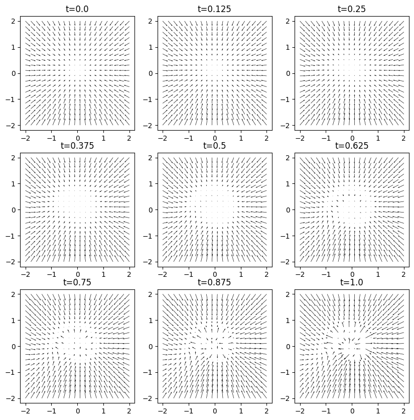
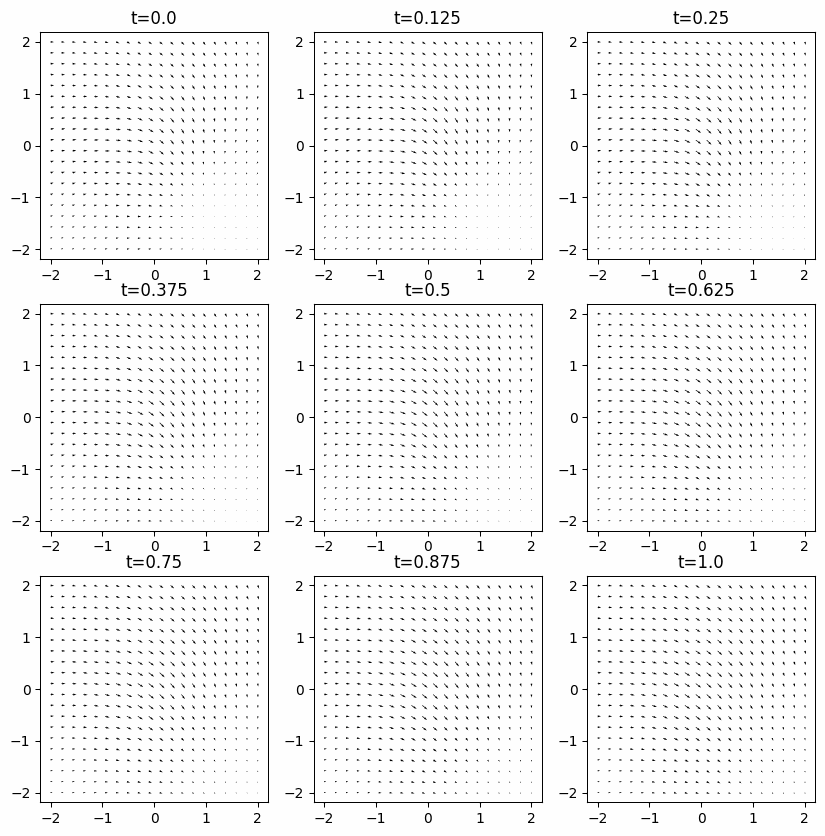
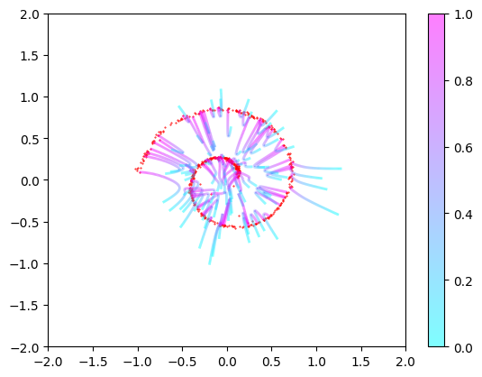
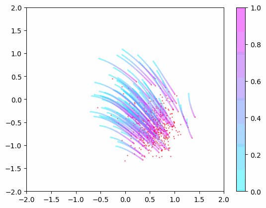
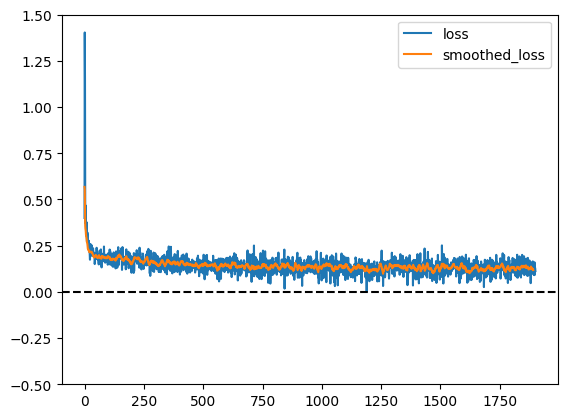

### Rectified Flow

```bash
python run.py flow_main
```

 | 
:-------------------------:|:-------------------------:
 | 



---

### Note:

- The loss is set to `mse - var`. This is to get a sense of how good the model is trained by looking at the loss (loss = 0 means fully trained). Loss sometimes goes negative as a result of stochastic nature of the mean and variance estimates.

- You might want to increase `config.plot_every` to get faster training.
